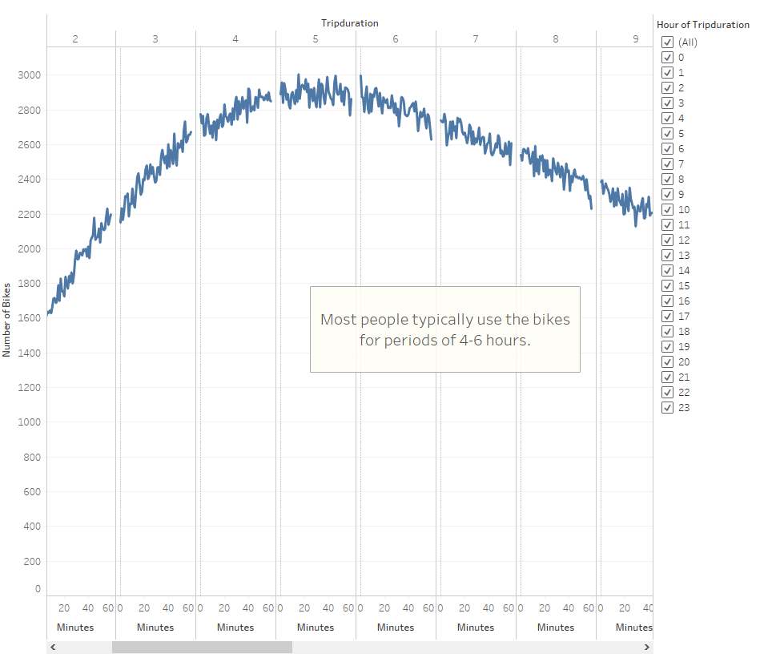
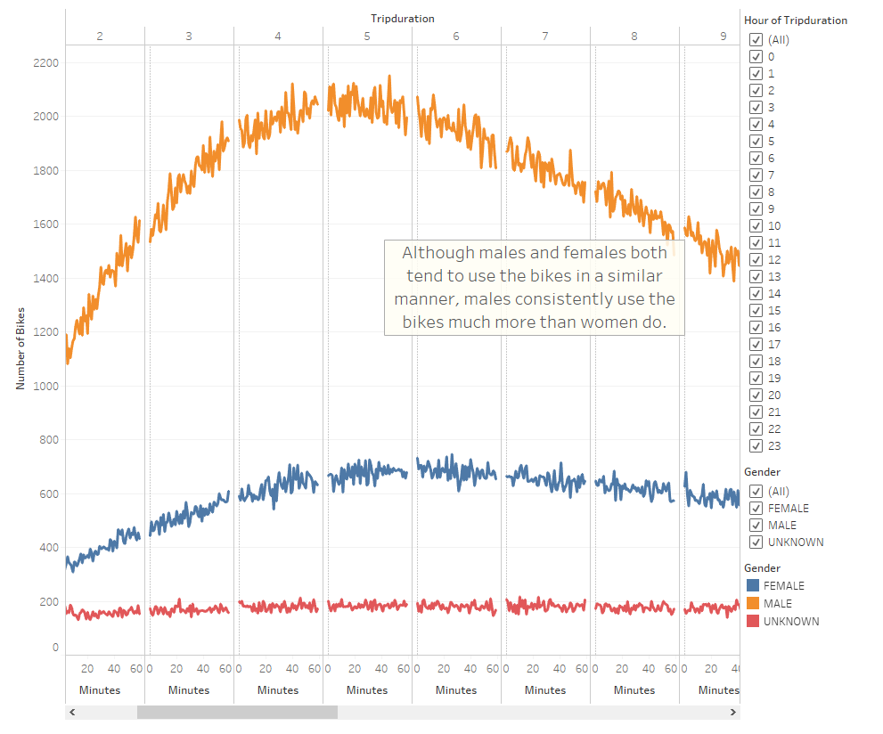
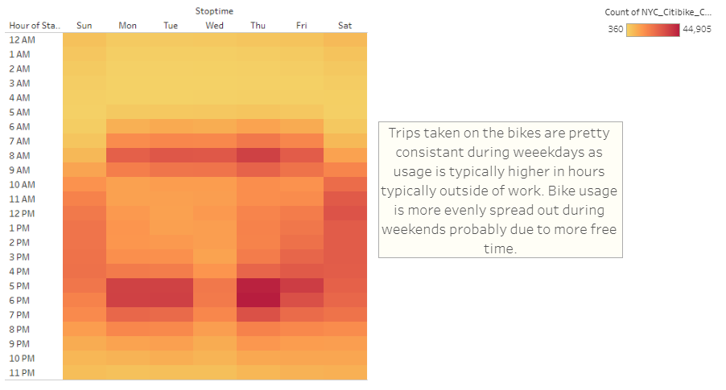
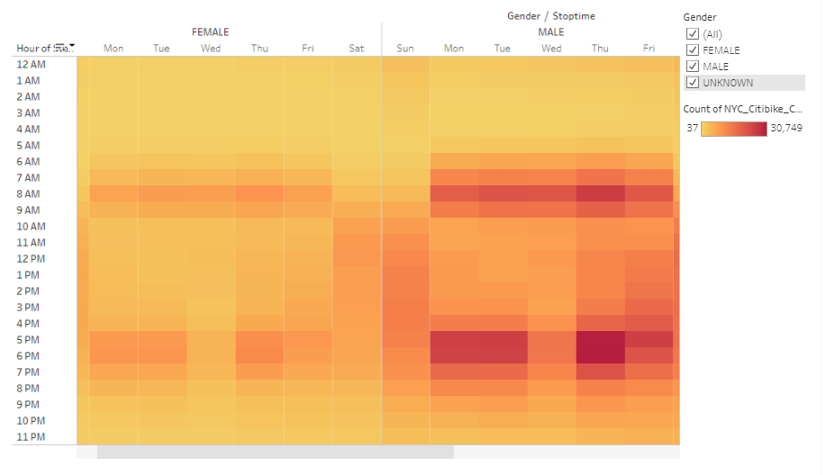
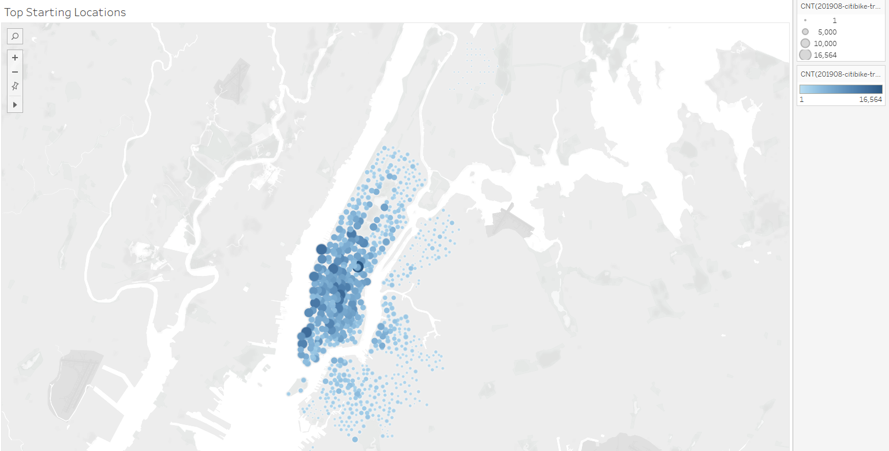

# **Bikesharing**

## **Overview**

In an effort to see whether Citibike, a bike service offered in New York City, could be replicated in Des Moines, Iowa we examined collected data taken by Citibike. This data was transformed to meet our needs and then visually represented in a series of charts through the use of Tableau so that they may be presented to a potential angel investor. The purpose of creating these graphs and analyzing this data is to figure out how the bike sharing service works in New York so that we can create a successful business plan.

---
You can visit the [Dashboard here](https://public.tableau.com/profile/francisco4691#!/vizhome/Challenge_16052222916600/Challenge?publish=yes)!

## **Results**

After analyzing the data collected from Citibike there are several conclusions that can be drawn. These results are listed below and follow the visualizations created in my Tableau story:

1. The first visualization demonstrates the trip duration times for users, essentially demonstrating that most users typically do not use the bikes for very short or long periods of time. The chart revealed that users tend to use the bikes most for 4-6 hours.

2. The second result depicted by the second visualization in the Tableau story adds another layer to the first analysis regarding trip duration times. This visualization reveals the breakdown of user trips by gender and shows that although males and females follow a similar pattern in use (both prefer to use the bikes most for periods of times in the range of 4-6 hours), there are many more male users than females.

3. The third result depicted by the Trips taken by weekday per hour heatmap is that there is a pretty consistent pattern in terms of usage that alters depending on whether it is a weekday or the weekend. On weekdays bike usage appears to take place much more on hours that are typically outside of work - prior to 9AM and after 5PM. On weekends, bike usage is much more evenly spread out, presumably because people have more free time to ride a bike.

4. The fourth visualization in the Tableau story breaks down by Trips taken by weekday per hour by gender. This new heatmap further illustrates result number 2; that is that women and men tend to use the bikes in similar ways (typically around work hours and evenly on weekends) but men tend to use the bike service much more.

5. The fifth visualization/result is illustrated in the form of a heatmap that demosntrates user types by gender by weekday. This heatmap demonstrates that the main form of bike user are subscribers rather than customers and again shows that the majority of subscribers are men. Interestingly, it appears that when it comes to customers and not subscribers, men and women make equal use of the bike sharing service.

To drive home these results, we can refer to two simple graphs that were created prior to the challenge part of this project in the form of pie charts. These two pie charts offer another visual representation of the gender breakdown of users in the dataset used and user types. Again, these graphs are consistent with our results: men make up more users and most users are actually subscribed to the program.

## **Summary**

In short, the analysis of the data gathered from Citi bike revealed a couple of major findings that may be important for someone considering launching a similar business. Citi bike in New York appears to have a predominantly male client base and gathers most of its revenue from subscribers rather than from customers. Moreover, there are patterns that can be observed in bike use among all users: bikes are used most on weekdays early in the morning or late in the day when most people are not at work and are used evenly during weekends. These results are significant because they allow a potential business trying to imitate this bike sharing service to capitalize on its strengths and avoid potential pitfalls.

Although the analysis was very useful in uderstanding who uses the bikes most and how the bikes are used, I belive the analyis could be improved in the following two ways:

1. Assuming the potential business will take place in a different city, such Des Moines, Iowa, like in this challenge, we should look at population distribution by area. In the module, we mapped bike use over the New York City area and illustrated heavy use with markers being larger and darker. This revealed that Citi bike's use was heaviest in the heart of the city and was much lighter towards the outskirts of the city. By knowing population density or which areas see the most traffic in another city, a similar bike sharing service in a different city could allocate bikes accordingly offering more in denser areas and less where there are less people. Data pulled from the Census Beaureau might offer insight as to population density, all one would have to do is clean and format said data so that it is able to be mapped.

2. Another additional analysis that I believe would be useful for a business considering imitating the bike sharing service would be to look at bike use during different times of the year. Although not all cities share the same weather or seasonal changes that New York City does, a comparison on use based on fluctuating seasonal weather would be useful for determining which time of year is more profitable for a business. In order to perform this analysis, all one would have to do is take different data cuts like the one used in this analysis and then create a visualization in the form of a heat map or bar graph breaking down use by time or simply have a count of bike users.

